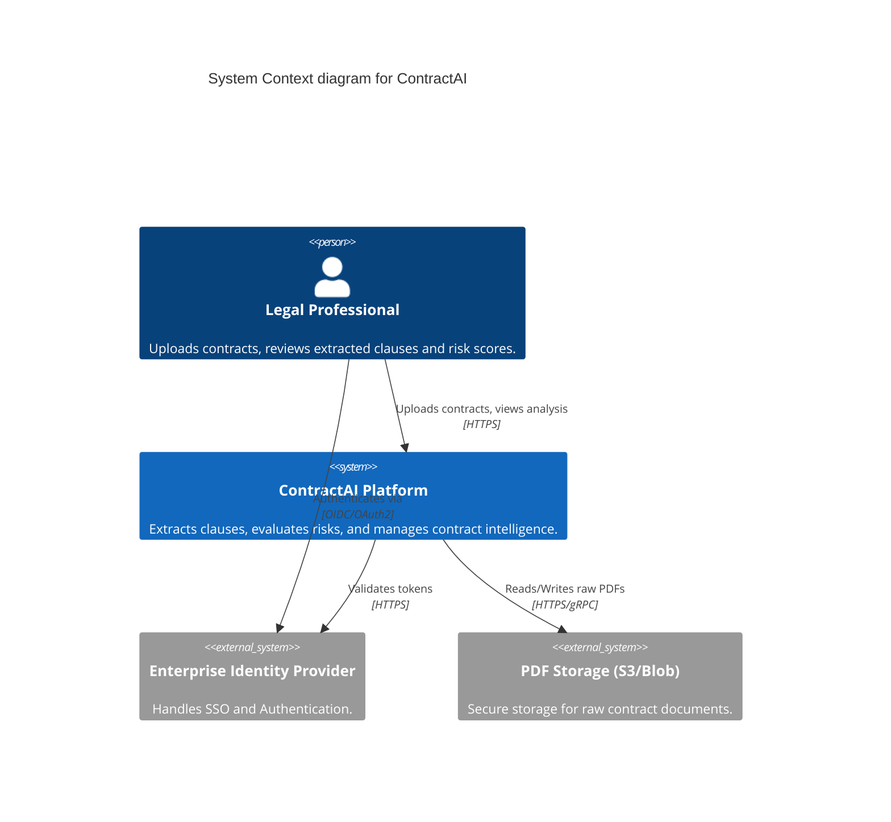
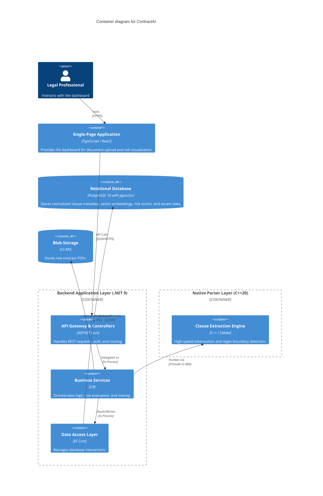
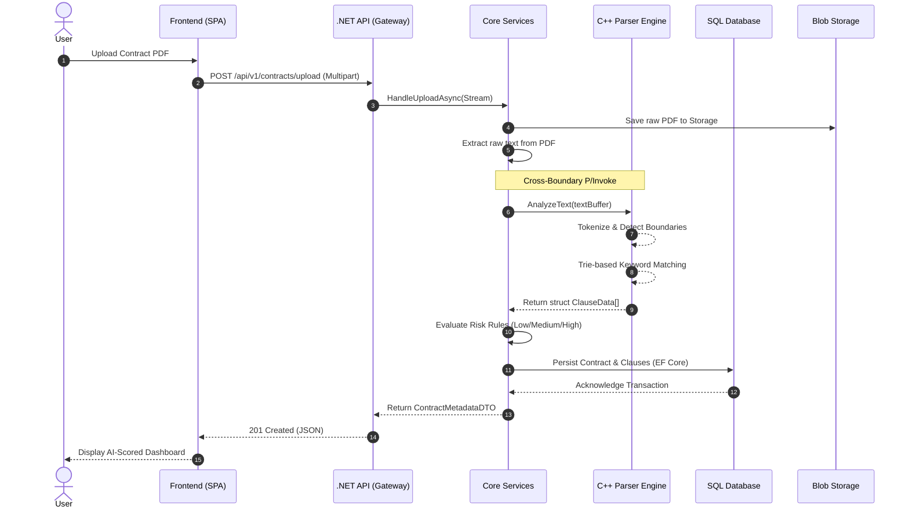

# ContractAI Architecture Document

## 1. Executive Summary & System Purpose

**ContractAI** is an enterprise-grade contract intelligence platform designed to automate the extraction of critical clauses, provide immediate obligation summaries, and compute AI-driven legal risk scores. 

**Mission:** To reduce manual legal review time by >70% through a highly scalable, automated pipeline that blends low-level high-performance text processing with robust enterprise web architecture.

**Core Non-Functional Requirements (NFRs):**
- **Throughput & Performance:** P99 parsing latency < 200ms per standard contract (up to 100 pages). Support for thousands of concurrent extraction requests.
- **Scalability:** Stateless backend architecture with containerized deployment, allowing horizontal scaling under load.
- **Security & Data Privacy:** Zero-trust architecture, tenant data isolation, in-transit and at-rest encryption, and automated PII redaction capabilities.
- **Maintainability:** Separation of concerns via Clean Architecture (Onion Architecture) in .NET 9, ensuring the core domain is isolated from infrastructure and external dependencies.
- **Resilience:** Graceful degradation on malformed inputs, robust exception handling across the C++/C# interoperability boundary, and automated retry mechanisms.

---

## 2. System Context & High-Level Architecture (C4 Level 1 & Level 2)

ContractAI is built on a polyglot architecture that leverages the performance of native C++ for computationally heavy text parsing and the rich enterprise ecosystem of .NET Core for the backend API.

### C4 Level 1: System Context Diagram

### C4 Level 2: Container Diagram

---

## 3. Subsystem Deep-Dives

### 3.1 Parser Subsystem (C++20)
The Parser Subsystem is the core processing engine responsible for raw text tokenization, keyword extraction, and clause boundary detection.
- **Internal Design:** Utilizes high-performance Trie-based keyword indexing and SIMD-accelerated regex engines (e.g., RE2 or PCRE2).
- **Memory Management:** Strictly employs RAII (Resource Acquisition Is Initialization) and smart pointers (`std::unique_ptr`, `std::shared_ptr`). Makes extensive use of `std::string_view` for zero-copy string manipulation, drastically reducing heap allocations during tokenization.
- **.NET Integration:** Exposes a C-ABI compatible interface (`extern "C"`) compiled as a dynamic library (`.dll` or `.so`). The .NET backend invokes these endpoints using `LibraryImport` (P/Invoke source generators), passing struct pointers and pre-allocated buffers to minimize GC pinning overhead.

// C-ABI Interface exported by libcontract_parser.so / .dll
extern "C" {
    PARSER_API int ParseContractClauses(const char* textBuffer, size_t bufferLength, ClauseOutput** outClauses, size_t* outCount);
    PARSER_API void FreeClauseOutput(ClauseOutput* clauses, size_t count);
}

### 3.2 Backend Subsystem (.NET 9 Clean Architecture)
The backend follows Clean Architecture principles to ensure the business domain remains agnostic of UI and database concerns.
- **ContractAI.Core:** Contains the Domain Entities (`Contract`, `Clause`, `RiskScore`), Value Objects, Enums, and Repository Interfaces. Has zero external dependencies.
- **ContractAI.Services:** Implements the application use cases (e.g., `ContractAnalysisService`). Contains the P/Invoke wrappers to interface with the C++ parser. Houses the rules engine for calculating risk flags (Low/Medium/High) based on extracted keywords.
- **ContractAI.Data:** Implements repository interfaces using Entity Framework Core for complex graphs and Dapper for high-performance read-only queries. Implements the Unit of Work pattern.
- **ContractAI.API:** Exposes versioned RESTful endpoints. Utilizes built-in Dependency Injection, Exception Handling Middleware (for RFC 7807 Problem Details), and JWT Bearer Authentication.

### 3.3 Data Access & Storage
- **Relational Schema:** Normalized schema powered by **PostgreSQL 16**. A `contracts` table stores document metadata and maintains a one-to-many relationship with the `clauses` table.
- **Vector & Semantic Search:** Uses the `pgvector` extension for storing 1536-dimensional/768-dimensional clause embeddings, enabling semantic similarity matching (e.g., Cosine/L2 distance) alongside full-text search (`tsvector`).
- **CQRS & Read/Write Segregation:** High-volume writes and batch processing utilize EF Core / `Npgsql` binary COPY operations. Dashboard reads utilize Dapper with optimized indexes (B-Tree on foreign keys, HNSW/IVFFlat on embeddings, and GIN for trigram search).

### 3.4 Frontend Architecture
- **Framework:** React with TypeScript for strict type safety mirroring backend DTOs.
- **Modularity:** Feature-based folder structure. Uses isolated UI components for PDF rendering (e.g., `pdf.js`), risk score badges, and data grids.
- **State Management:** Utilizes React Query / SWR for server-state caching, optimistic updates, and background data fetching, keeping the UI highly responsive while parsing jobs complete asynchronously.

---

## 4. Data Flow & Processing Lifecycle

The lifecycle of a contract document flows continuously from the client to the native parser and finally to persistent storage.

---

## 5. Cross-Cutting Concerns

### 5.1 Security
- **Data Isolation:** Row-Level Security (RLS) implemented in the database to ensure strict tenant data isolation in multi-tenant environments.
- **Secret Management:** Integration with Azure Key Vault or AWS Secrets Manager. No secrets in source control.
- **Input Validation:** Strict FluentValidation rules on all incoming DTOs. PII redaction pipeline sanitizes sensitive entities before they are persisted or returned to the UI.

### 5.2 Observability
- **Logging:** Structured JSON logging via Serilog, pushing to ELK or Seq.
- **Tracing:** OpenTelemetry integration across the HTTP pipeline and EF Core to generate distributed traces.
- **Health Checks:** Built-in .NET `/healthz` endpoints verifying database connectivity, blob storage access, and C++ library load status.

### 5.3 Error Handling & Resilience
- **Native Boundary:** Specific try/catch wrappers around P/Invoke calls. If the C++ engine segfaults or throws (caught via SEH / signal handling where possible), the API gracefully catches the exception, logs a fatal error, and returns a `500` Problem Details response without crashing the CLR.
- **Resilience:** Polly is used for transient fault handling (retries and circuit breakers) when communicating with Blob Storage or external microservices.

---

## 6. Deployment & Infrastructure Topography

The system is containerized for seamless deployment across any Docker-compatible environment (Kubernetes, ECS, or Docker Swarm).

- **Multi-Stage Builds:** The Dockerfile employs a multi-stage process. Stage 1 compiles the C++ parser using CMake and GCC/Clang. Stage 2 builds the .NET application using the .NET SDK. Stage 3 creates a lean, Alpine-based or Ubuntu Chiseled runtime image containing only the .NET runtime and the compiled `.so` parser library.
- **docker-compose Topology:**
  - `api`: The ASP.NET Core container (exposing port 8080).
  - `frontend`: An NGINX container serving the compiled SPA (exposing port 80).
  - `db`: `pgvector/pgvector:pg16` image with pre-initialized schemas and extensions.
  - `storage`: MinIO instance simulating S3 blob storage for local development.
- **Horizontal Scaling:** The API is completely stateless. Uploaded files are streamed directly to persistent blob storage, allowing multiple API replicas to process incoming requests concurrently behind a load balancer.

---

## 7. Architectural Decision Records (ADRs)

### ADR-001: Selection of C++20 for the Clause Extraction Engine
- **Context:** The system must process massive volumes of dense legal text, demanding extreme throughput for string matching and regex evaluation.
- **Decision:** Implement the core extraction engine in C++20 rather than native C#.
- **Justification:** C++ allows for zero-overhead abstractions, precise memory layout control, and access to highly optimized SIMD regex libraries (like RE2). Using `std::string_view` avoids the garbage collection pressure that massive string allocations would cause in .NET, ensuring consistent low-latency processing.

### ADR-002: Adoption of Clean Architecture in .NET 9
- **Context:** Enterprise applications tend to tightly couple business logic with database access or HTTP concerns, hindering long-term maintainability and testability.
- **Decision:** Adopt the Clean Architecture (Onion) pattern for the backend.
- **Justification:** By placing the domain entities and core interfaces at the center (with zero dependencies), we guarantee that business rules (like Risk Scoring) can be unit-tested in complete isolation. Infrastructure (EF Core, P/Invoke wrappers) depends on the Core, not the other way around.

### ADR-003: P/Invoke vs. Microservice for Native Interop
- **Context:** The .NET backend needs to communicate with the C++ parser.
- **Decision:** Use in-process P/Invoke (`LibraryImport`) instead of deploying the C++ engine as a separate gRPC/REST microservice.
- **Justification:** P/Invoke eliminates network latency and serialization/deserialization overhead. Passing pointers to pinned arrays or pre-allocated buffers across the C-ABI boundary takes nanoseconds compared to milliseconds for network calls, which is critical for hitting the <200ms P99 latency target.
