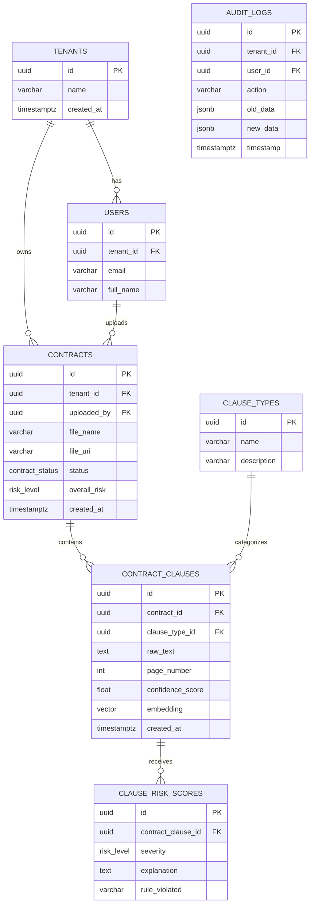

# ContractAI Database Design Document

## 1. Database Architectural Overview

**ContractAI** utilizes a hybrid relational-vector database architecture built on **PostgreSQL 16**. This design allows the system to seamlessly blend traditional highly-normalized transactional workflows with advanced semantic AI capabilities.

**Design Philosophy:**
- **Normalization:** Strict 3rd Normal Form (3NF) for transactional data to eliminate redundancy.
- **Global Conventions:** 
  - All identifiers utilize `snake_case`.
  - Primary Keys are universally v4 UUIDs generated via `uuid-ossp`.
  - Timestamps enforce UTC using `timestamptz`.
- **Soft Deletion:** Records are never hard-deleted; an `is_deleted` boolean combined with a `deleted_at` timestamp ensures complete historical retention and referential integrity.
- **Auditability:** Mandatory `created_at` and `updated_at` timestamps on all tables, supplemented by an immutable `audit_logs` append-only table for compliance.

---

## 2. Entity-Relationship Model



---

## 3. Detailed Schema Specifications (Data Dictionary)

### `tenants`
Multi-tenancy isolation root.
| Column Name | Data Type | Constraints | Description |
|---|---|---|---|
| `id` | `UUID` | `PK`, `DEFAULT uuid_generate_v4()` | Unique tenant identifier. |
| `name` | `VARCHAR(255)` | `NOT NULL` | Corporate name of the tenant. |
| `is_deleted` | `BOOLEAN` | `DEFAULT false` | Soft delete flag. |
| `created_at` | `TIMESTAMPTZ` | `DEFAULT NOW()` | Creation UTC timestamp. |
| `updated_at` | `TIMESTAMPTZ` | `DEFAULT NOW()` | Last update UTC timestamp. |

### `users`
Identity and access management mapped to a tenant.
| Column Name | Data Type | Constraints | Description |
|---|---|---|---|
| `id` | `UUID` | `PK` | Unique user identifier. |
| `tenant_id` | `UUID` | `FK -> tenants(id)`, `NOT NULL` | Tenant binding for RLS isolation. |
| `email` | `VARCHAR(255)` | `NOT NULL`, `UNIQUE` | User login email. |
| `full_name` | `VARCHAR(255)` | `NOT NULL` | Display name. |
| `is_active` | `BOOLEAN` | `DEFAULT true` | Can access the platform. |
| `created_at` | `TIMESTAMPTZ` | `DEFAULT NOW()` | Creation timestamp. |

### `contracts`
Core document metadata representing a single parsed file.
| Column Name | Data Type | Constraints | Description |
|---|---|---|---|
| `id` | `UUID` | `PK` | Unique contract identifier. |
| `tenant_id` | `UUID` | `FK -> tenants(id)`, `NOT NULL` | RLS tenant binding. |
| `uploaded_by` | `UUID` | `FK -> users(id)` | User who initiated parsing. |
| `file_name` | `VARCHAR(255)` | `NOT NULL` | Original uploaded PDF filename. |
| `file_uri` | `VARCHAR(1024)` | `NOT NULL` | S3/Blob storage path reference. |
| `status` | `contract_status` | `DEFAULT 'UPLOADED'` | Processing state machine enum. |
| `overall_risk` | `risk_level` | `DEFAULT 'UNKNOWN'` | Aggregate document risk rating. |
| `created_at` | `TIMESTAMPTZ` | `DEFAULT NOW()` | Upload timestamp. |

### `contract_clauses`
Extracted textual clauses augmented with vector embeddings.
| Column Name | Data Type | Constraints | Description |
|---|---|---|---|
| `id` | `UUID` | `PK` | Unique clause identifier. |
| `contract_id` | `UUID` | `FK -> contracts(id)` | Parent document reference. |
| `clause_type_id` | `UUID` | `FK -> clause_types(id)` | Semantic classification category. |
| `raw_text` | `TEXT` | `NOT NULL` | The exact extracted text boundary. |
| `page_number` | `INT` | `NULL` | Page where clause originated. |
| `byte_offset` | `INT` | `NULL` | Starting byte/char offset in text. |
| `confidence_score`| `FLOAT` | `CHECK (>= 0.0 AND <= 1.0)` | Extraction certainty from parser. |
| `embedding` | `vector(1536)`| `NULL` | pgvector 1536-D semantic embedding. |

### `clause_risk_scores`
Individual risk assessments per clause evaluated by the AI engine.
| Column Name | Data Type | Constraints | Description |
|---|---|---|---|
| `id` | `UUID` | `PK` | Unique risk score identifier. |
| `contract_clause_id`| `UUID` | `FK -> contract_clauses(id)`| Specific clause evaluated. |
| `severity` | `risk_level` | `NOT NULL` | Risk severity flag enum. |
| `rule_violated` | `VARCHAR(255)` | `NOT NULL` | Policy rule triggering the risk. |
| `explanation` | `TEXT` | `NOT NULL` | AI-generated reasoning. |

### `audit_logs`
Immutable system audit trail.
| Column Name | Data Type | Constraints | Description |
|---|---|---|---|
| `id` | `UUID` | `PK` | Unique log entry identifier. |
| `tenant_id` | `UUID` | `FK -> tenants(id)` | RLS tenant binding. |
| `user_id` | `UUID` | `FK -> users(id)` | Actor performing action. |
| `action` | `VARCHAR(100)` | `NOT NULL` | Action taken (e.g., UPLOAD, DELETE). |
| `old_data` | `JSONB` | `NULL` | State before mutation. |
| `new_data` | `JSONB` | `NULL` | State after mutation. |
| `timestamp` | `TIMESTAMPTZ` | `DEFAULT NOW()` | Action UTC timestamp. |

---

## 4. Vector & Semantic Search Design (`pgvector`)

ContractAI leverages the `pgvector` extension to enable semantic search on extracted clauses, allowing legal professionals to query "find clauses similar to net 30 payment terms" without requiring exact keyword matches.

- **Embedding Dimensions:** `1536` dimensions, designed to integrate seamlessly with OpenAI's `text-embedding-3-small` or equivalent local models (e.g., Nomic Embed Text).
- **Distance Metric:** **Cosine Distance (`<=>`)**. In highly-dimensional text embedding spaces, cosine distance yields better semantic similarity boundaries than L2 Distance (`<->`), as it normalizes magnitude and focuses strictly on orientation/angle.
- **Vector Indexing Strategy:** We implement **HNSW (Hierarchical Navigable Small World)** indexing over IVFFlat. 
  - *Tradeoff:* HNSW consumes slightly more memory and index build time but provides significantly faster query latency (high recall) and does not require pre-training the index with existing data (unlike IVFFlat's `lists` parameter).
  - *Configuration:* `CREATE INDEX ON contract_clauses USING hnsw (embedding vector_cosine_ops) WITH (m = 16, ef_construction = 64);`

---

## 5. Indexing & Query Performance Optimization

Performance is managed through highly targeted index strategies:

- **B-Tree Indexes:** Applied to all Foreign Keys (`tenant_id`, `contract_id`, `uploaded_by`) to ensure rapid `JOIN` performance and `ON DELETE CASCADE` resolution.
- **Partial Indexes:** Queries filtering by status are optimized using partial indexes.
  - *Example:* `CREATE INDEX idx_contracts_unprocessed ON contracts(status) WHERE status IN ('UPLOADED', 'PARSING');`
- **Trigram & Full-Text (GIN):** Clauses must be rapidly searchable by keyword.
  - *Example:* `CREATE INDEX idx_clauses_raw_text_trgm ON contract_clauses USING GIN (raw_text gin_trgm_ops);`

---

## 6. Data Partitioning & Archival Strategy

- **Table Partitioning:** The `contract_clauses` and `audit_logs` tables are projected to grow massively (millions of rows per tenant). They will utilize **PostgreSQL Range Partitioning** partitioned by `created_at` (monthly chunks).
- **Archival Offloading:** Contracts in `ARCHIVED` status older than 7 years (standard legal retention) will have their structured clause data serialized to JSON/Parquet, pushed to AWS S3 Glacier / Azure Blob Archive, and hard-deleted from the active PostgreSQL partitions to maintain index efficiency.

---

## 7. Security, Privacy & Compliance

- **Multi-Tenant Isolation (RLS):** Row-Level Security ensures cross-tenant data leaks are physically impossible at the database engine level. 
  - All application queries execute as an `app_user` role.
  - The .NET backend executes `SET LOCAL app.current_tenant_id = 'uuid';` at the start of every DbContext transaction.
  - RLS Policy: `CREATE POLICY tenant_isolation_policy ON contracts FOR ALL USING (tenant_id = current_setting('app.current_tenant_id')::uuid);`
- **PII & Data Redaction:** Extract fields recognized as highly sensitive (e.g., SSN, specific monetary thresholds) are dynamically masked at the application API layer; the database stores the raw form encrypted at rest using Cloud Provider managed keys (TDE).
- **RBAC Roles:** 
  - `app_reader`: SELECT-only permissions.
  - `app_writer`: INSERT/UPDATE/DELETE.
  - `migration_user`: DDL permissions for EF Core schema updates.

---

## 8. DDL Initialization Script (`database/schema/01_init.sql`)

Below is the foundational PostgreSQL 16 script that scaffolds the entire architecture.

```sql
-- database/schema/01_init.sql
-- PostgreSQL 16 ContractAI Schema Initialization

BEGIN;

-- 1. Extensions
CREATE EXTENSION IF NOT EXISTS "uuid-ossp";
CREATE EXTENSION IF NOT EXISTS "pg_trgm";
CREATE EXTENSION IF NOT EXISTS "vector";

-- 2. Enums
CREATE TYPE contract_status AS ENUM (
    'UPLOADED',
    'PARSING',
    'PARSED_SUCCESS',
    'PARSED_ERROR',
    'ARCHIVED'
);

CREATE TYPE risk_level AS ENUM (
    'UNKNOWN',
    'LOW',
    'MEDIUM',
    'HIGH',
    'CRITICAL'
);

-- 3. Core Tables

-- TENANTS
CREATE TABLE tenants (
    id UUID PRIMARY KEY DEFAULT uuid_generate_v4(),
    name VARCHAR(255) NOT NULL,
    is_deleted BOOLEAN DEFAULT FALSE,
    created_at TIMESTAMPTZ DEFAULT NOW(),
    updated_at TIMESTAMPTZ DEFAULT NOW()
);
COMMENT ON TABLE tenants IS 'Multi-tenant isolation root boundaries.';

-- USERS
CREATE TABLE users (
    id UUID PRIMARY KEY DEFAULT uuid_generate_v4(),
    tenant_id UUID NOT NULL REFERENCES tenants(id) ON DELETE CASCADE,
    email VARCHAR(255) NOT NULL UNIQUE,
    full_name VARCHAR(255) NOT NULL,
    is_active BOOLEAN DEFAULT TRUE,
    created_at TIMESTAMPTZ DEFAULT NOW(),
    updated_at TIMESTAMPTZ DEFAULT NOW()
);

-- CONTRACTS
CREATE TABLE contracts (
    id UUID PRIMARY KEY DEFAULT uuid_generate_v4(),
    tenant_id UUID NOT NULL REFERENCES tenants(id) ON DELETE CASCADE,
    uploaded_by UUID REFERENCES users(id) ON DELETE SET NULL,
    file_name VARCHAR(255) NOT NULL,
    file_uri VARCHAR(1024) NOT NULL,
    status contract_status DEFAULT 'UPLOADED',
    overall_risk risk_level DEFAULT 'UNKNOWN',
    is_deleted BOOLEAN DEFAULT FALSE,
    created_at TIMESTAMPTZ DEFAULT NOW(),
    updated_at TIMESTAMPTZ DEFAULT NOW()
);

-- CLAUSE_TYPES (Lookup Taxonomy)
CREATE TABLE clause_types (
    id UUID PRIMARY KEY DEFAULT uuid_generate_v4(),
    name VARCHAR(100) NOT NULL UNIQUE,
    description TEXT
);

-- CONTRACT_CLAUSES
CREATE TABLE contract_clauses (
    id UUID PRIMARY KEY DEFAULT uuid_generate_v4(),
    contract_id UUID NOT NULL REFERENCES contracts(id) ON DELETE CASCADE,
    clause_type_id UUID REFERENCES clause_types(id) ON DELETE SET NULL,
    raw_text TEXT NOT NULL,
    page_number INT,
    byte_offset INT,
    confidence_score FLOAT CHECK (confidence_score >= 0.0 AND confidence_score <= 1.0),
    embedding vector(1536),
    created_at TIMESTAMPTZ DEFAULT NOW(),
    updated_at TIMESTAMPTZ DEFAULT NOW()
);

-- CLAUSE_RISK_SCORES
CREATE TABLE clause_risk_scores (
    id UUID PRIMARY KEY DEFAULT uuid_generate_v4(),
    contract_clause_id UUID NOT NULL REFERENCES contract_clauses(id) ON DELETE CASCADE,
    severity risk_level NOT NULL,
    rule_violated VARCHAR(255) NOT NULL,
    explanation TEXT NOT NULL,
    created_at TIMESTAMPTZ DEFAULT NOW()
);

-- AUDIT_LOGS
CREATE TABLE audit_logs (
    id UUID PRIMARY KEY DEFAULT uuid_generate_v4(),
    tenant_id UUID NOT NULL REFERENCES tenants(id) ON DELETE CASCADE,
    user_id UUID REFERENCES users(id) ON DELETE SET NULL,
    action VARCHAR(100) NOT NULL,
    old_data JSONB,
    new_data JSONB,
    timestamp TIMESTAMPTZ DEFAULT NOW()
);

-- 4. Triggers for updated_at
CREATE OR REPLACE FUNCTION update_modified_column() 
RETURNS TRIGGER AS $$
BEGIN
    NEW.updated_at = NOW();
    RETURN NEW;
END;
$$ LANGUAGE plpgsql;

CREATE TRIGGER update_tenant_modtime BEFORE UPDATE ON tenants FOR EACH ROW EXECUTE FUNCTION update_modified_column();
CREATE TRIGGER update_user_modtime BEFORE UPDATE ON users FOR EACH ROW EXECUTE FUNCTION update_modified_column();
CREATE TRIGGER update_contract_modtime BEFORE UPDATE ON contracts FOR EACH ROW EXECUTE FUNCTION update_modified_column();
CREATE TRIGGER update_clause_modtime BEFORE UPDATE ON contract_clauses FOR EACH ROW EXECUTE FUNCTION update_modified_column();

-- 5. Indexing (B-Tree, GIN, and Vector HNSW)
CREATE INDEX idx_users_tenant_id ON users(tenant_id);
CREATE INDEX idx_contracts_tenant_id ON contracts(tenant_id);
CREATE INDEX idx_contracts_uploaded_by ON contracts(uploaded_by);
CREATE INDEX idx_contract_clauses_contract_id ON contract_clauses(contract_id);
CREATE INDEX idx_clause_risk_scores_clause_id ON clause_risk_scores(contract_clause_id);

-- Partial Index for Active processing
CREATE INDEX idx_contracts_unprocessed ON contracts(status) WHERE status IN ('UPLOADED', 'PARSING');

-- Trigram Index for fuzzy text search on clauses
CREATE INDEX idx_clauses_raw_text_trgm ON contract_clauses USING GIN (raw_text gin_trgm_ops);

-- HNSW Vector Index for Semantic Cosine Distance Search
CREATE INDEX idx_clauses_embedding_hnsw ON contract_clauses USING hnsw (embedding vector_cosine_ops) WITH (m = 16, ef_construction = 64);

-- 6. Row Level Security (RLS) Example Setup
ALTER TABLE contracts ENABLE ROW LEVEL SECURITY;
CREATE POLICY tenant_isolation_policy ON contracts 
    FOR ALL 
    USING (tenant_id = current_setting('app.current_tenant_id')::uuid);

COMMIT;
```
